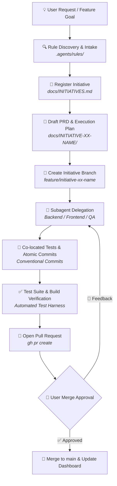

<div align="center">


**Enterprise-grade SDLC operating system, guardrail framework, and initiative orchestration for AI pair-programming with Google Antigravity & Anthropic Claude Code.**

[](https://antigravity.google)
[](https://docs.anthropic.com/en/docs/agents-and-tools/claude-code)
[](#-the-agentic-sdlc-lifecycle)
[](#-core-guardrails-enforced)
[](#-security--governance)
[](#-core-guardrails-enforced)
[](LICENSE)

<br />

[Features](#-key-features) •
[SDLC Lifecycle](#-the-agentic-sdlc-lifecycle) •
[Repository Structure](#-repository-structure) •
[Quickstart](#-quickstart--installation) •
[Enforced Guardrails](#-core-guardrails-enforced) •
[Security & Governance](#-security--governance) •
[Subagents](#-subagent-orchestration-matrix)

</div>

---

## 💡 Why Agentic SDLC Starter Kit?

Standard AI coding assistants often produce uncontrolled scope creep, monolithic untracked commits, unauthorized dependency installations, and broken builds.

The **Agentic SDLC Starter Kit** provides a battle-tested operational framework that turns AI coding agents into disciplined engineering team members. It establishes transparent communication protocols, mandatory initiative tracking, isolated Git branches, automated test harnesses, and strict review gates.

---

## ✨ Key Features

- 🛡️ **Mandatory Transparency First:** The agent must explain its intent, rationale, and target files before executing terminal commands or modifying code.
- 🔒 **Zero Secret Leakage:** Strict policy forbidding credentials, private tokens, API keys, and `.env` data from being committed, logged, or written to markdown plans.
- 📦 **Zero-Drift Dependency Policy:** No `npm install`, `pip install`, or system packages are installed autonomously. All external additions require explicit trade-off justification and user approval.
- 📋 **Dual-Blueprint Planning (PRD + Execution Plan):** Every initiative is tracked in a central dashboard (`docs/INITIATIVES.md`) and requires both a Product Requirements Document (`PRD.md`) and a step-by-step Technical Execution Plan (`EXECUTION_PLAN.md`).
- 🌿 **Disciplined Git Initiative Branching:** Work is isolated in dedicated long-lived initiative branches (`feature/initiative-xx-...`) with atomic Conventional Commits and co-located unit tests.
- 🤖 **Universal Subagent Delegation:** Out-of-the-box delegation patterns for Backend/Core, Frontend/UI, Architectural Review, and QA Verification agents across Antigravity and Claude Code.
- ⚡ **1-Command Zero-Friction Setup:** Scaffold any new or existing repository with safe, non-destructive installer backups.

---

## 🔄 The Agentic SDLC Lifecycle



---

## 📦 Repository Structure

```
.
├── .github/
│   └── CODEOWNERS                     # Protects agent instructions from PR tampering
├── AGENTS.md                          # Primary operating rules & transparency directives
├── CLAUDE.md                          # Claude Code entrypoint (zero-drift pointer to AGENTS.md)
├── .agents/
│   └── rules/
│       ├── git_branch_pr_workflow.md  # Mandatory Git branching & PR protocol
│       ├── initiative_tracking.md     # Single Source of Truth dashboard sync
│       └── subagent_delegation.md     # Specialist subagent orchestration patterns
├── docs/
│   ├── INITIATIVES.md                 # Central initiative registry & status dashboard
│   └── templates/
│       ├── PRD_TEMPLATE.md            # Standardized PRD blueprint
│       └── EXECUTION_PLAN_TEMPLATE.md # Step-by-step Technical Execution Plan blueprint
├── skills/
│   └── agentic-sdlc/
│       └── SKILL.md                   # Antigravity skill definition for SDLC automation
└── scripts/
    └── init-project.sh                # Non-destructive 1-command installer with backups
```

---

## 🚀 Quickstart & Installation

### Option 1: Apply to an Existing Project (Recommended)

Run the installer script pointing to your target workspace:

```bash
# If cloned locally:
/path/to/agentic-starter-kit/scripts/init-project.sh .

# Or inspect & run directly:
git clone https://github.com/sparrownet/agentic-starter-kit.git /tmp/agentic-starter-kit
/tmp/agentic-starter-kit/scripts/init-project.sh .
rm -rf /tmp/agentic-starter-kit
```

> **Note:** The installer is **non-destructive**. If existing configuration files exist in your target directory, it automatically creates timestamped `.bak` backups before updating.

### Option 2: Create a New Repository from Template

Use the GitHub CLI to generate a brand new repository using this template:

```bash
gh repo create my-awesome-project --template sparrownet/agentic-starter-kit --private --clone
```

### Option 3: Antigravity Custom Skill Registration

This repository includes a native Antigravity skill in `skills/agentic-sdlc/SKILL.md`. To use it across all projects, symlink or copy it to your Antigravity skills directory:

```bash
mkdir -p ~/.gemini/antigravity-cli/skills
cp -r skills/agentic-sdlc ~/.gemini/antigravity-cli/skills/
```

---

## 🛡️ Core Guardrails Enforced

| Rule | File | Enforcement & Guarantee |
| :--- | :--- | :--- |
| **Transparency First** | [`AGENTS.md`](./AGENTS.md) | Agent MUST explain intent, reasoning, and target files before executing commands or editing files. |
| **Secret & Data Safety** | [`AGENTS.md`](./AGENTS.md) | Zero secret leakage. Credentials, `.env` values, and private tokens must NEVER be committed, logged, or recorded in docs. |
| **No Rogue Installs** | [`AGENTS.md`](./AGENTS.md) | Native-first policy. External dependencies (`npm`, `pip`, etc.) require trade-off justification & user sign-off. |
| **Initiative Tracking** | [`.agents/rules/initiative_tracking.md`](./.agents/rules/initiative_tracking.md) | Live sync with `docs/INITIATIVES.md` + dual `PRD.md` & `EXECUTION_PLAN.md` creation before code is written. |
| **Branch & PR Protocol** | [`.agents/rules/git_branch_pr_workflow.md`](./.agents/rules/git_branch_pr_workflow.md) | Long-lived `feature/initiative-xx-...` branches, atomic Conventional Commits, co-located tests, explicit merge approval. |
| **Subagent Delegation** | [`.agents/rules/subagent_delegation.md`](./.agents/rules/subagent_delegation.md) | Delegating complex phases to specialized subagents for clean context and parallel development. |

---

## 🔒 Security & Governance

This starter kit incorporates defense-in-depth measures for AI agent interactions:

1. **Anti-Leakage Protocol:** Directives in [`AGENTS.md`](./AGENTS.md) mandate credential masking and prevent accidental exfiltration of private keys, environment variables, or database connection strings.
2. **Rule Integrity Protection:** The included [`.github/CODEOWNERS`](./.github/CODEOWNERS) ensures that PRs modifying `.agents/` or `AGENTS.md` cannot be merged without explicit review from authorized security maintainers, neutralizing indirect prompt-injection vectors.
3. **Safe, Non-Destructive Installer:** `scripts/init-project.sh` uses strict error handling (`set -euo pipefail`) and creates timestamped backups of modified files to prevent data loss.
4. **Supply-Chain Guard:** Autonomous package installations are blocked by default, protecting development environments against dependency confusion and typo-squatted malicious packages.

---

## 📊 Initiative Status Dashboard Reference

Initiatives tracked in `docs/INITIATIVES.md` transition through the following standard lifecycle states:

| Badge | Status | Description |
| :---: | :--- | :--- |
| 📝 | **`In Definition`** | Requirements gathering, PRD drafting, and technical feasibility review. |
| 🛠️ | **`Ready for R&D`** | PRD & Execution Plan approved, architecture validated, ready for branch creation. |
| 🚧 | **`In Progress`** | Actively being developed on dedicated initiative branch with atomic commits. |
| 🔍 | **`In Review`** | PR opened, test harness passing 100%, awaiting user verification. |
| ✅ | **`Done`** | Merged into `main`, verified green in production/staging. |
| ⏸️ | **`On Hold`** | Temporarily paused pending external dependencies or scope adjustment. |

---

## 🤖 Subagent Orchestration Matrix

When executing complex initiatives, work is divided across specialized subagents to keep context clean and maximize parallelism:

| Subagent Role | Primary Focus | Key Responsibilities |
| :--- | :--- | :--- |
| **Backend & Core Logic Specialist** | Server & Core Architecture | Core engines, algorithms, API contracts, domain logic, unit tests. |
| **Frontend & UI Specialist** | User Interface & State | Responsive components, state management, accessibility, UI testing. |
| **Architect Reviewer** | System Design & Audits | Cross-cutting architecture reviews, contract validation, security verification. |
| **QA & Test Specialist** | Verification & Coverage | End-to-end test suites, regression testing, test harness validation. |

---

## 📄 License

This project is licensed under the [MIT License](LICENSE). Feel free to adapt and use it across your teams and projects!

