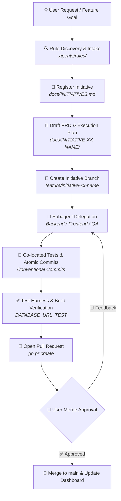

<div align="center">

# 🤖 Agentic SDLC Starter Kit

**Enterprise-grade SDLC operating system, guardrail framework, and initiative orchestration for AI pair-programming with Google Antigravity.**

[](https://antigravity.google)
[](#-the-agentic-sdlc-lifecycle)
[](#-core-guardrails-enforced)
[](#-core-guardrails-enforced)
[](LICENSE)

<br />

[Features](#-key-features) •
[SDLC Lifecycle](#-the-agentic-sdlc-lifecycle) •
[Repository Structure](#-repository-structure) •
[Quickstart](#-quickstart--installation) •
[Enforced Guardrails](#-core-guardrails-enforced) •
[Subagents](#-subagent-orchestration-matrix)

</div>

---

## 💡 Why Agentic SDLC Starter Kit?

Standard AI coding assistants often produce uncontrolled scope creep, monolithic untracked commits, unauthorized dependency installations, and risky database migrations during test runs.

The **Agentic SDLC Starter Kit** provides a battle-tested operational framework that turns Google Antigravity into a disciplined engineering team member. It establishes transparent communication protocols, mandatory initiative tracking, isolated Git branches, automated test harnesses, and multi-tier database safety.

---

## ✨ Key Features

- 🛡️ **Mandatory Transparency First:** The agent must explain its intent, rationale, and target files before executing terminal commands or modifying code.
- 📦 **Zero-Drift Dependency Policy:** No `npm install`, `pip install`, or system packages are installed autonomously. All external additions require explicit trade-off justification and user approval.
- 📋 **Dual-Blueprint Planning (PRD + Execution Plan):** Every initiative is tracked in a central dashboard (`docs/INITIATIVES.md`) and requires both a Product Requirements Document (`PRD.md`) and a step-by-step Technical Execution Plan (`EXECUTION_PLAN.md`).
- 🌿 **Disciplined Git Initiative Branching:** Work is isolated in dedicated long-lived initiative branches (`feature/initiative-xx-...`) with atomic Conventional Commits and co-located unit tests.
- 🗄️ **3-Tier Database Isolation:** Strict separation between Production (`DATABASE_URL`), Development (`DATABASE_URL_DEV`), and Test (`DATABASE_URL_TEST`). Automated test suites run exclusively against isolated test schemas.
- 🤖 **Specialist Subagent Delegation:** Out-of-the-box delegation patterns for Backend/DB, Frontend/UI, Architectural Review, and QA Verification agents.
- ⚡ **1-Command Zero-Friction Setup:** Scaffold any new or existing repository in seconds using the automated initializer.

---

## 🔄 The Agentic SDLC Lifecycle



---

## 📦 Repository Structure

```
.
├── AGENTS.md                          # Global operating rules & transparency directives
├── .agents/
│   └── rules/
│       ├── git_branch_pr_workflow.md  # Mandatory Git branching & PR protocol
│       ├── initiative_tracking.md     # Single Source of Truth dashboard sync
│       ├── subagent_delegation.md     # Specialist subagent orchestration patterns
│       └── db_environment_isolation.md# 3-tier database isolation (Prod/Dev/Test)
├── docs/
│   ├── INITIATIVES.md                 # Central initiative registry & status dashboard
│   └── templates/
│       ├── PRD_TEMPLATE.md            # Standardized PRD blueprint
│       └── EXECUTION_PLAN_TEMPLATE.md # Step-by-step Technical Execution Plan blueprint
├── skills/
│   └── agentic-sdlc/
│       └── SKILL.md                   # Antigravity skill definition for SDLC automation
└── scripts/
    └── init-project.sh                # 1-command installer script for projects
```

---

## 🚀 Quickstart & Installation

### Option 1: Apply to an Existing Project (Recommended)

From your target project repository, run the installer script:

```bash
/path/to/agentic-starter-kit/scripts/init-project.sh .
```

Or via `curl`:

```bash
curl -fsSL https://raw.githubusercontent.com/sparrownet/agentic-starter-kit/main/scripts/init-project.sh | bash -s -- .
```

### Option 2: Create a New Repository from Template

Use the GitHub CLI to generate a brand new repository using this template:

```bash
gh repo create my-awesome-project --template sparrownet/agentic-starter-kit --private --clone
```

### Option 3: Antigravity Custom Skill Registration

This repository includes a native Antigravity skill in `skills/agentic-sdlc/SKILL.md`. To use it across all projects, symlink or copy it to your Antigravity skills directory:

```bash
mkdir -p ~/.gemini/antigravity-cli/skills
cp -r skills/agentic-sdlc ~/.gemini/antigravity-cli/skills/
```

---

## 🛡️ Core Guardrails Enforced

| Rule | File | Enforcement & Guarantee |
| :--- | :--- | :--- |
| **Transparency First** | [`AGENTS.md`](./AGENTS.md) | Agent MUST explain intent, reasoning, and target files before executing commands or editing files. |
| **No Rogue Installs** | [`AGENTS.md`](./AGENTS.md) | Native-first policy. External dependencies (`npm`, `pip`, etc.) require trade-off justification & user sign-off. |
| **Initiative Tracking** | [`.agents/rules/initiative_tracking.md`](./.agents/rules/initiative_tracking.md) | Live sync with `docs/INITIATIVES.md` + dual `PRD.md` & `EXECUTION_PLAN.md` creation before code is written. |
| **Branch & PR Protocol** | [`.agents/rules/git_branch_pr_workflow.md`](./.agents/rules/git_branch_pr_workflow.md) | Long-lived `feature/initiative-xx-...` branches, atomic Conventional Commits, co-located tests, explicit merge approval. |
| **Database Isolation** | [`.agents/rules/db_environment_isolation.md`](./.agents/rules/db_environment_isolation.md) | Tests connect ONLY to `DATABASE_URL_TEST`. Production migrations strictly require explicit user approval. |
| **Subagent Delegation** | [`.agents/rules/subagent_delegation.md`](./.agents/rules/subagent_delegation.md) | Delegating complex phases to specialized subagents for clean context and parallel development. |

---

## 📊 Initiative Status Dashboard Reference

Initiatives tracked in `docs/INITIATIVES.md` transition through the following standard lifecycle states:

| Badge | Status | Description |
| :---: | :--- | :--- |
| 📝 | **`In Definition`** | Requirements gathering, PRD drafting, and technical feasibility review. |
| 🛠️ | **`Ready for R&D`** | PRD & Execution Plan approved, architecture validated, ready for branch creation. |
| 🚧 | **`In Progress`** | Actively being developed on dedicated initiative branch with atomic commits. |
| 🔍 | **`In Review`** | PR opened, test harness passing 100%, awaiting user verification. |
| ✅ | **`Done`** | Merged into `main`, verified green in production/staging. |
| ⏸️ | **`On Hold`** | Temporarily paused pending external dependencies or scope adjustment. |

---

## 🤖 Subagent Orchestration Matrix

When executing complex initiatives, work is divided across specialized subagents to keep context clean and maximize parallelism:

| Subagent Role | Primary Focus | Key Responsibilities |
| :--- | :--- | :--- |
| **Backend & DB Specialist** | Server & Data Layer | API routes, ORM schemas, database migrations, business logic, unit tests. |
| **Frontend & UI Specialist** | User Interface & State | Responsive components, state management, accessibility, UI testing. |
| **Architect Reviewer** | System Design & Audits | Cross-cutting architecture reviews, contract validation, security verification. |
| **QA & Test Specialist** | Verification & Coverage | End-to-end test suites, regression testing, isolated test database validation. |

---

## 📄 License

This project is licensed under the [MIT License](LICENSE). Feel free to adapt and use it across your teams and projects!
